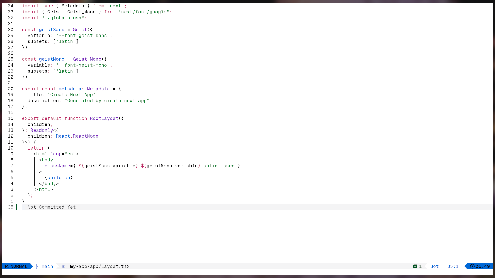
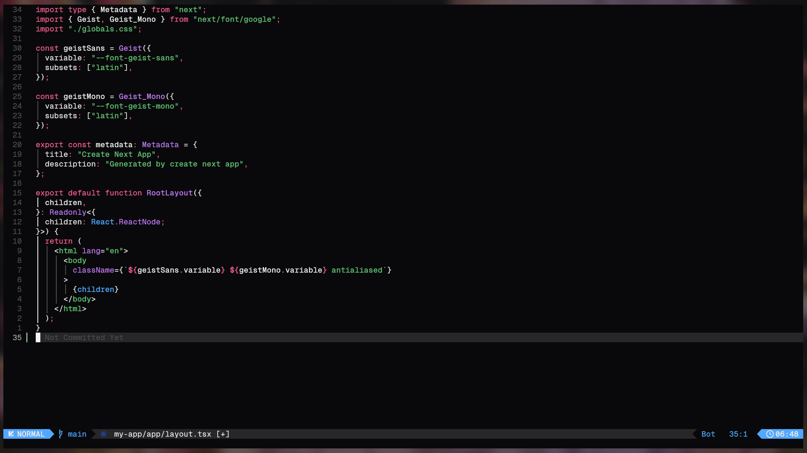

# Vercel Theme

## Preview

### Light Theme



### Dark Theme




## Installation

1. Using `Lazy`:

```lua
{ 'tiesen243/vercel.nvim' },
```

2. Using `Packer`:

```lua
use 'tiesen243/vercel.nvim'
```

## Configuration

To configure the plugin, you can call require('my-theme').setup({}), passing the table with the values in it. The following are the **defaults**:

```lua
require('vercel').setup({
    -- NOTE: if your configuration sets vim.o.background in your configuration for Neovim,
    -- the following setting will do nothing, since it'll be overriden.
    transparent = false, -- Boolean: Sets the background to transparent
    italics = {
        comments = true, -- Boolean: Italicizes comments
        keywords = true, -- Boolean: Italicizes keywords
        functions = true, -- Boolean: Italicizes functions
        strings = true, -- Boolean: Italicizes strings
        variables = true, -- Boolean: Italicizes variables
    },
    overrides = {}, -- A dictionary of group names, can be a function returning a dictionary or a table.
})
```

- **The `colorscheme()` function**

This function can be used to set the colorscheme in your editor, however, if it doesn't work for you, you can always use `vim.cmd.colorscheme('vercel')`.

### Specifics for Some Plugins

#### Bufferline.nvim

To use the theme with [bufferline.nvim](https://github.com/akinsho/bufferline.nvim), you can use the following configuration:

```lua
require('bufferline').setup({
    highlights = require('vercel').highlights.bufferline,
})
```

## Contributing

Contributions are welcome, please open an issue if you encounter any bug or if you find any improvements are needed for the code, also feel free to open a PR.

## Special Thanks

- This project is based on [nvim-colorscheme-template](https://github.com/datsfilipe/nvim-colorscheme-template) by @datsfilipe, used under the MIT License.

## License

This project is licensed under the MIT License - see the [LICENSE](./LICENSE) file for details.
